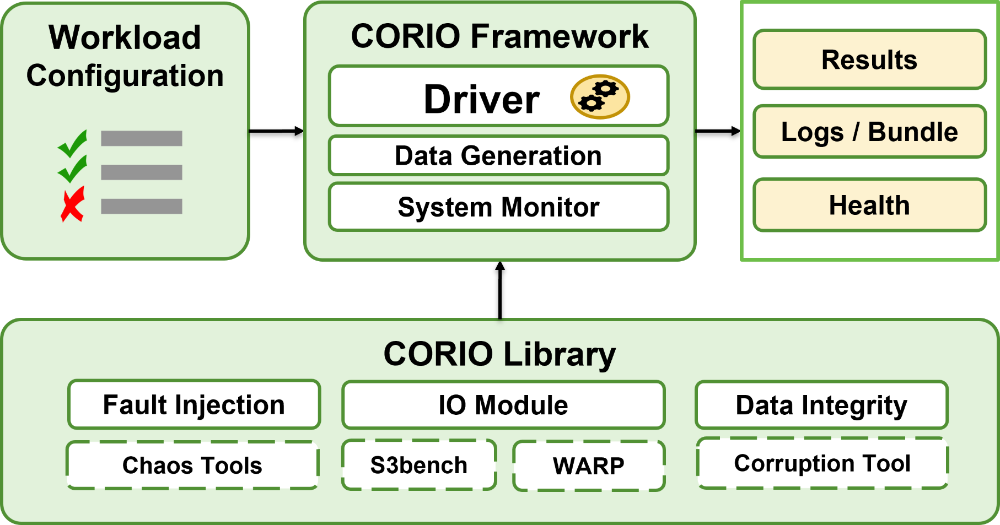
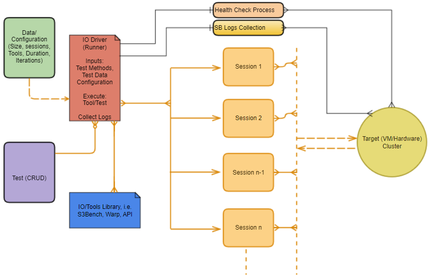

## CORIO (KOR-I-O)  
### A tool to check Sustainability of IO Operations for expected longer duration

Need for a tool which gives consistent outcome of where do we stand in terms of IO Path stability.
Hereby needed single aggregator / umbrella tool.

1. This tool has capability to embed multiple IO tools (S3bench, WARP, etc.) and benefits from their specific capabilities.
2. This can be Integrated for any other product requirements

### This tool is capable of executing matrix based execution as following:

This tool is capable to execute multi-level test suite that can be executed for a prolonged infinite period 
with increasing difficulty levels for them to Pass these set period, so we know the defects when fixed allows the 
system to withstand how much period of prolonged IO.
This tool generates exponential increasing IO sessions.

Scheme of  multiple tests suites execution is as following:

1. Start Given Test Suites/Execution, say N in parallel such that first test from 
each suite will start and will be marked pass once it achieves minimum run_length duration.
2. Then next set of Tests will start and previous will also continue.
3. It will increase load on target and, we can check IO sustainability in lesser time/duration  as compared to other
Tools.

### Integrated for CORTX Requirements:

1. Jira Integration.
2. Automated Execution with Jenkins.
3. System Health Check.
4. Resource Monitoring(CPU and Memory).
5. Generating Support Bundle Logs (Periodic and on failure).
6. Useful across teams (CI-CD, DST, Regression, ComponentQA, Dev, CFT).

### Additional Capabilities:

1. Simple and easy to execute tool.
2. Fully configurable S3 and IO workload to support Stress (exponential workload) as well as longevity (constant workload) testing
3. Error injection and failure modes (TBD).
4. Plug, and play architecture such that additional functionalities may be extended.
5. Can be extended with other IO protocols.

### Tool components:

#### Block Diagram:

* Configurations: This is actual workload specified/created by user.
* Parser: This section verifies the Test Configurations, Inputs and Structure used by Driver.
* Library: This sections consists of collection of code logic used by Test Scripts.
* Scripts: These are actual logic takes structured input from parser and executed by Driver.
* System Monitoring: This consists of monitoring CPU and Memory usages on client and server.
* Logging: Logs for individual tests in different files and upload to NFS as needed.
* Support Bundle: This is a CORTX specific feature where Server Logs are generated periodically and 
on failure, available for debugging purposes.
* Health Check: This section check the health of server (Status of Services).

#### IO Execution Process Flow:

- IO Driver will read tests from TEST Plan.
- Start executing System (CPU, Memory) Status Monitoring.
- System/Services Health Check:
    - If system health or services status is not stable or down/irrevocable then will not proceed for IO execution and 
    will report for analysis.
    - Space availability for IO (Need to stop IO if server disk space full).
    - If Space is full (not available) then will stop(not proceed) with IO and  will collect relevant logs and 
      will do analysis.
- Start multiple workload configuration(tests) in parallel:  
    - Record the test thread/process for status monitoring.
    - All threads(sessions) will continue run till terminates due to failure.
- Wait for one of the failure conditions/Tests stopping time.
- If test stopped before given time due to any failure:
    - Report Failure and Stop for debugging.
- Check the Stop Conditions.
- Mark test pass/fail (in JiraTest Plan) .
- Collect SB Logs every  irrespective of test status continuously.
- If Test failed collect SB logs and upload to designated NFS Server (from server machine).
- Arrange/Collect and push Test/Tools o/p IO logs to designated NFS Server (from Client machine).
- Start next test if previous tests executed successfully for defined minimum run time.
